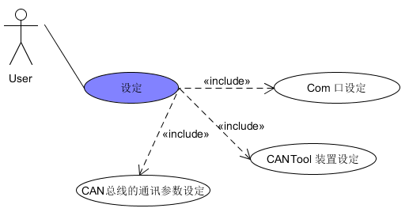
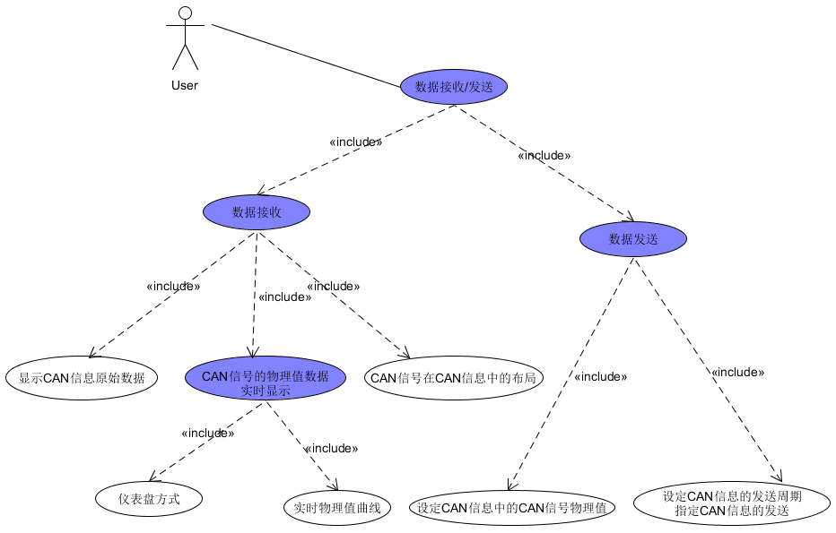

 **"CANTOOL"项目需求文档** 

 **修改历史** 

| 日期       | 版本号          | 描述  | 作者  |
| :-------------: |:-------------:| :-----:| :-----:|
| 2017 10 8     | v0.0 | 初始的需求文档框架 | 温浩 |
|         |       |    |    |
|  |      |    |    |

##1 引言
###1.1 背景
	在现代汽车控制技术中，汽车中会使用多个电子控制装置（ECU：Electronic Control Unit）对整车进行控制。
	ECU之间的信息交换更多地依赖于CAN(Controller Area Network)总线的网络连接方式来完成。
	为了检测和控制CAN bus的信息内容，需要使用CAN bus检测设备。
	CanTool装置是完成CANbus检测的工具。
###1.2 目的
	本文提出的CanToolApp工具的目的在于更好地实现CAN数据的显示及控制
##2 功能需求
	本系统的功能需求主要分为三个模块，设定、数据存储和数据接收(发送)。
###2.1 设定模块

 

图 1 设定模块UseCase

	
 
	设定模块主要包含：COM口的设定、CANtool设定、CAN总线参数设定。
1.	COM设定

	COM设定主要实现以下功能。第一：系统可以自动搜索到本机可以使用的COM口，并以列表的方式显示；第二：选择某一COM口，系统弹出基本信息设定的输入界面，界面可以设置COM口波特率115200、设置数据位数8、设置停止位数1。

###2.2 数据存储模块

 

图 2 数据存储模块UseCase

	
 
	数据存储模块主要包含：设定文件存储、数据文件存储。
1.	设定文件存储

	设定文件存储主要包含三个功能，第一：设定内容存储，主要是指Com口设定信息和CANtool设定信息的存储；第二：用户选择的显示方式可保存到CanToolApp设定文件中，供下次使用，例如如用户选择仪表盘方式显示。第三：加载的数据库相关信息存储，主要包括加载用户提供的CAN信息和信号数据库。
2.	数据文件存储

	数据文件存储主要包含四个部分的数据存储。第一：针对接收到的CAN信息数据，系统可将其实时保存为数据文件，存储格式为CSV；第二：针对用户提供的CAN信息和信号数据库，系统加载之后，将其以树状结构在GUI界面中显示；第三：针对用户的CAN信息和信号数据库，系统可以将其另存为xml和JSON (JavaScript Object Notation)格式。第四：系统将xml或Json格式存储的数据库，转换为CAN信息和信号数据库格式
	

###2.3 数据接收（发送）模块

 

图 3 数据接收（发送）模块UseCase

	
 
	数据接收与发送模块主要包含：数据接收模块、数据发送模块。
1.	数据接收模块

	数据接收模块主要实现数据的接收、解析、显示。第一：系统可以接收多个CAN信息；
	第二：系统对接收的信息，通过CAN信息及CAN信号数据库进行解析；第三：系统将CAN信息原始数据和CAN信息中的CAN信号的物理值实时数据进行显示。在物理值显示时可以让用户选择仪表盘方式显示接收到CAN信号物理值；此外，还可以让用户选择某些接收到的CAN信号，显示其变化的实时物理值曲线；另外，可以显示CAN信号在CAN信息的布局；针对用户提供的CAN信息和信号数据库，加载后，将其以树状结构在GUI界面中显示。
2.	数据发送模块

	数据发送模块主要是是实现对数据设置、编辑、发送，可理解为App可将用户设定的物理值转换为CAN信号值，将CAN信息中包含的所有CAN信号合成完整的CAN信息后，发送给CanTool装置，发送到CAN总线上。
	首先：系统可以指定要发送的多个CAN信息。其次：系统允许用户设定CAN信息中的CAN信号物理值；系统允许用户设定CAN信息的发送周期（0-65535ms即0x0000-0xFFFF）。

