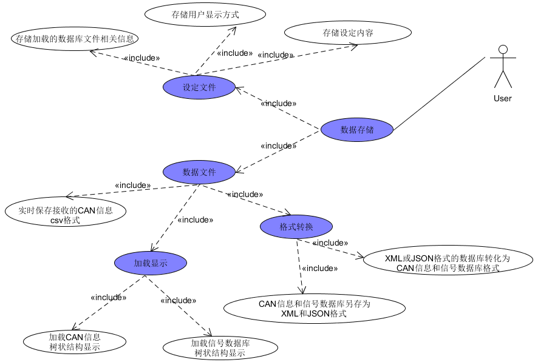

 **"CANTOOL"项目需求文档** 

##1 引言
###1.1 背景
	在现代汽车控制技术中，汽车中会使用多个电子控制装置（ECU：Electronic Control Unit）对整车进行控制。
	ECU之间的信息交换更多地依赖于CAN(Controller Area Network)总线的网络连接方式来完成。
	为了检测和控制CAN bus的信息内容，需要使用CAN bus检测设备。
	CanTool装置是完成CANbus检测的工具。
###1.2 目的
	本文提出的CanToolApp软件的目的在于更好地实现CAN数据的显示及控制
##2 功能需求
	本系统的功能需求主要分为三个模块，设定、数据存储和数据接收(发送)。
###2.1 设定模块

###2.2 数据存储模块

 

图 2 数据存储模块UseCase

	
 
	数据存储模块主要包含：设定文件存储、数据文件存储。
1.	设定文件存储

	设定文件存储主要包含三个功能，第一：设定内容存储，主要是指Com口设定信息和CANtool设定信息的存储；第二：用户选择的显示方式可保存到CanToolApp设定文件中，供下次使用，例如如用户选择仪表盘方式显示。第三：加载的数据库相关信息存储，主要包括加载用户提供的CAN信息和信号数据库。
2.	数据文件存储

	数据文件存储主要包含四个部分的数据存储。第一：针对接收到的CAN信息数据，系统可将其实时保存为数据文件，存储格式为CSV；第二：针对用户提供的CAN信息和信号数据库，系统加载之后，将其以树状结构在GUI界面中显示；第三：针对用户的CAN信息和信号数据库，系统可以将其另存为xml和JSON (JavaScript Object Notation)格式。第四：系统将xml或Json格式存储的数据库，转换为CAN信息和信号数据库格式
	

###2.3 数据接收（发送）模块

