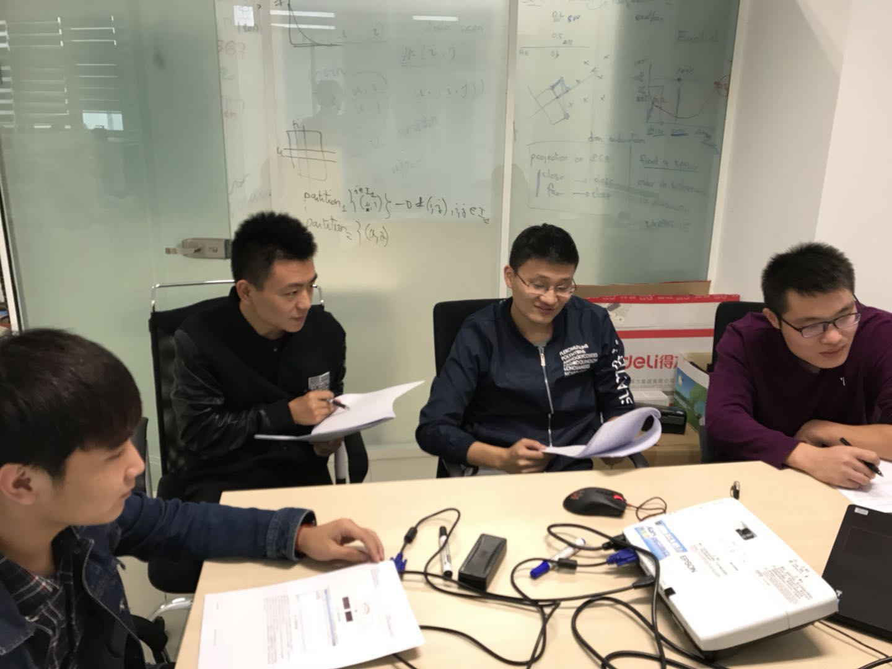

# 2017_10_10
		结合项目的需求文档，进行4人的小型组会，对项目需求进一步明确，并且分配了各自的任务，自己负责的部分是安卓串口通信，
	今天编写了一部分代码，还未完全调试成功，但是有一些进展。

 

组会图

#2017_10_11
		今天对安卓串口通信代码调试，网上查阅资料发现高版本的安卓很难用串口编写，考虑用蓝牙通信，
	在网上查阅资料并编写简单的蓝牙通信Demo,目前正在调试中。

#2017_10_12
		对昨天的蓝牙通信Demo进行调试，已经能够成功地接收和发送数据，基本上实现蓝牙的数据传输功能。

#2017_10_13
		今天做了自定义仪表盘控件，实现了其基本功能。明天的任务是对其界面的美化。

#2017_10_14
		休息

#2017_10_15
		继续完善仪表盘的界面美化，学习JSON的格式。

#2017_10_16
		学习数据格式，了解数据的解析与编码

#2017_10_17
		组内交流讨论，组长分配每个人的代码合并任务，自己目前完成蓝牙收发数据的整合。

#2017_10_18
		继续对蓝牙收发数据进行整合，对发送数据界面进行设计及其逻辑实现。