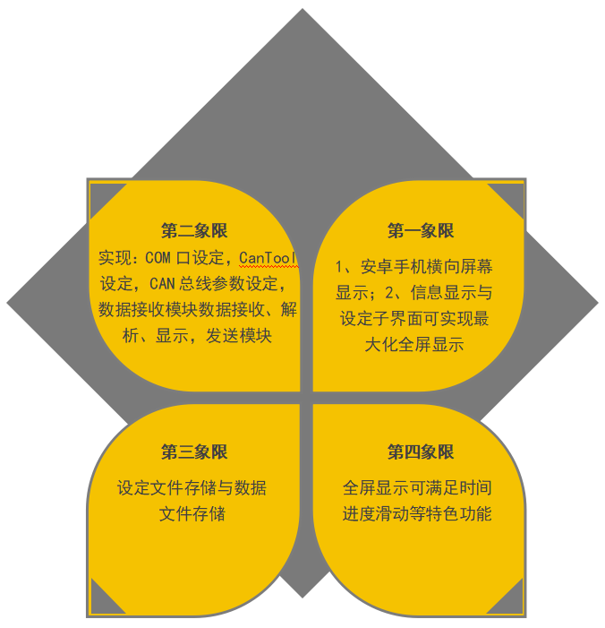

##我们小组的产品移动终端Android的CanToolApp
###第一：背景：
	产品简介：在现代汽车控制技术中，汽车中会使用多个电子控制装置（ECU：Electronic Control Unit）对整车进行控制。ECU之间的信息交换更多地依赖于CAN(Controller Area Network)总线的网络连接方式来完成。为了检测和控制CAN bus的信息内容，需要使用CAN bus检测设备。CanTool装置是完成CANbus检测的工具。CanToolApp工具的目的在于更好地实现CAN数据的显示及控制。

	功能简介：功能主要分为三个模块，设定、数据存储和数据接收(发送)。其中设定模块主要包含：COM口的设定、CANtool设定、CAN总线参数设定。数据存储模块主要包含：设定文件存储、数据文件存储。数据接收与发送模块主要包含：数据接收模块、数据发送模块。
###第二：四象限功能划分
	之前我们讲解了四象限功能分析的介绍。在这里我们针对我们的产品进行四象限介绍。

	第一象限：第一象限主要划分了产品的杀手功能，且此功能是必要的需求：默认显示方式为——Android安卓手机能够屏幕是横向的显示；产品显示和设定界面可最大化全屏显示。

	第二象限：第二象限主要划分了产品的外围功能，且此功能是必要需求：COM口的设定、CANtool设定、CAN总线参数设定;数据接收模块主要实现数据的接收、解析、显示;数据发送模块主要是是实现对数据设置、编辑、发送

	第三象限：第三象限主要划分了产品是外围功能，且此功能是辅助需求：设定文件存：设定内容存储，用户选择的显示方式，加载的数据库相关信息存储;数据文件存储主要包含四个部分的数据存储

	第四象限：第四象限主要划分了产品是杀手功能，且此功能是辅助需求：全屏显示界面可滑动时间进度等特色功能

 

图 1 四象限划分

###第三：策略
	针对小组人员有限，时间有限的情况。我们小组采取的策略是：
	第一象限：采取差异化办法，全力以赴开发产品的杀手功能。
	第二象限：因为产品第二象限的外围功能在整个产品中地位很重要，所以针对此部分的功能，我们优先采用优化的办法，如果时间压力过大的话，会逐渐在部分功能上采取抵消的办法。
	第三象限：此象限的功能点，我们采取维持的办法，以最低的支出维持此功能。
	第四象限：此象限的功能点我们优先采取不做的策略，后期时间足够的话，会转而采取维持策略，提升功能点的完善性能。

###第四：投资力度
	投资力度：针对对产品的理解以及四象限的划分，我们在不同阶段投资力度的针对点发生了变化。投资力度主要是指：时间与人力的投入。投入对象主要是：惊喜功能（在此项目中指杀手功能），核心功能，基本功能。

	在项目前期：重点开发第二象限与第三象限功能，优化第二象限功能，实现产品的基础功能与核心功能
	在项目中期：完善外围功能的同时，重点转移到第一象限的杀手功能，保证软件产品的特色
	在项目后期：保持基础与核心功能的完备，差异化的策略重点完善杀手功能，第四象限在有足够资源的情况下，迅速完善。